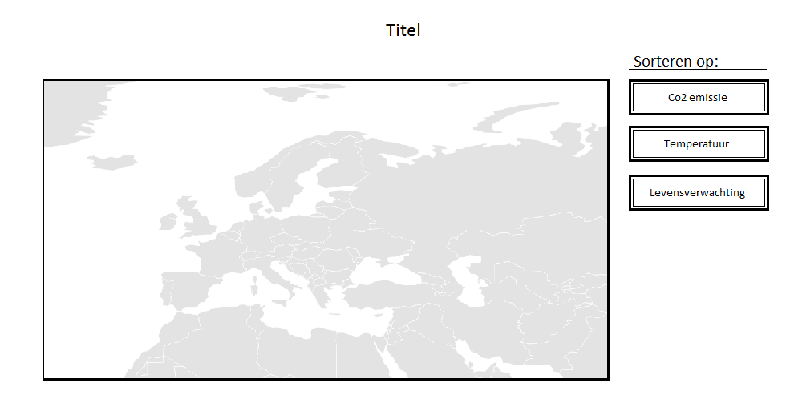
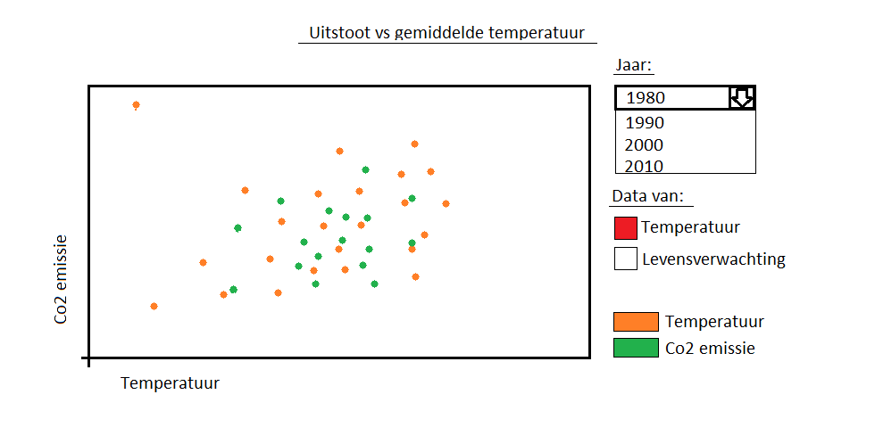
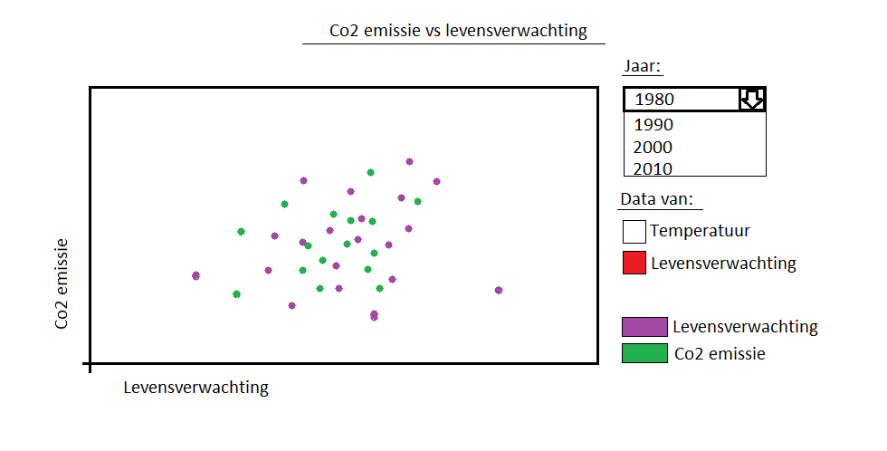
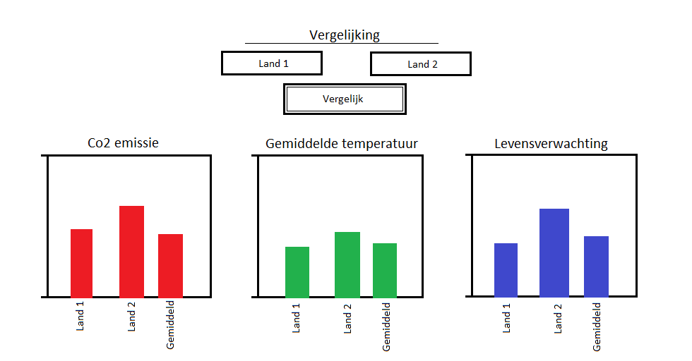

# Modules
My project consists of 3 different main modules:
- SVG map of Europe
- Scatterplot for Co2 vs life expectancy or temperature
- Comparisson for two countries on Co2 emmissions, temperature or life expectancy

Each of those modules have got their own smaller sub-modules that add additional
functionalities:

SVG map:
- Map in color from most to least Co2 emmissions
- Change scaling from Co2 to temperature or life expectancy
- tooltip with population, co2 temperature or life expectancy data

Scatterplot:
- Change the data of the plot with data from different years
- change the variables from life expectancy to temperature or the other way round

Comparison:
- Form that asks for 2 country names
- Barchart with Co2 data from the 2 countries
- dropdown to change the data from Co2 to temperature or life expectancy

# Advanced sketches

# Libraries
For this project I will be using the following library;
- D3 main library:
  http://d3js.org/d3.v3.min.js
- D3 library for the map and topo options
  https://raw.githubusercontent.com/markmarkoh/datamaps/master/dist/datamaps.world.min.js
  http://cdnjs.cloudflare.com/ajax/libs/d3/3.5.3/d3.min.js
  http://cdnjs.cloudflare.com/ajax/libs/topojson/1.6.9/topojson.min.js
- D3 library for the tooltips
  http://labratrevenge.com/d3-tip/javascripts/d3.tip.v0.6.3.js

# Data sources
Temperature data:
http://www.eea.europa.eu/data-and-maps/data/external/european-climate-assessment-dataset-eca-d

Co2 data:
http://ec.europa.eu/eurostat/statistics-explained/index.php/Greenhouse_gas_emission_statistics

Life expectancy data:
http://ec.europa.eu/eurostat/statistics-explained/index.php/Mortality_and_life_expectancy_statistics#Source_data_for_tables_and_figures_.28MS_Excel.29

# Database
I my project I won't be using a database solution.
