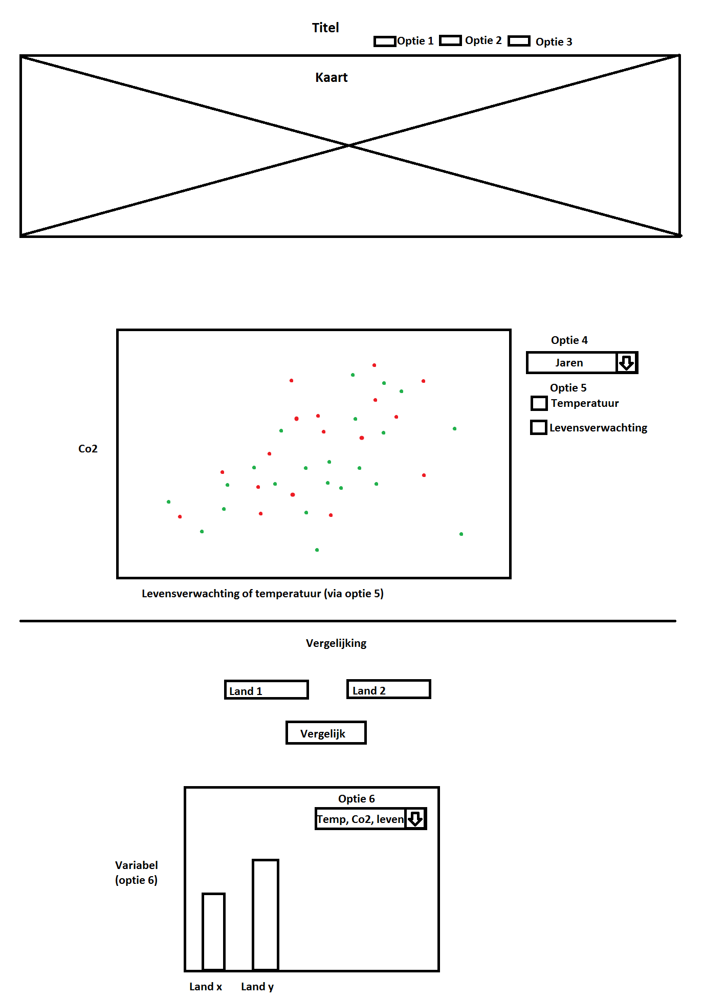

# Programmeer project
Thom Mekelenkamp - 11167998

# Index:
- Doel
- Ontwerp
- Schets
- Data
- Externe bronnen
- Limitaties
- MVP

# Doel
Met mijn visualisatie wil ik aantonen of er daadwerkelijk een verband is tussen
de levensverwachting, de gemiddelde temperatuur en de co2 uitstoot van een land.
https://milieudefensie.nl/publicaties/factsheets/informatieblad-luchtvervuiling-en-de-gevolgen-voor-onze-gezondheid
Het bovenstaande informatieblad van milieudefensie claimt dat "Luchtvervuiling in Nederland zorgt ervoor dat we gemiddeld
een jaar korter leven". Ik wil gegevens over de levensverwachting en de uitstoot
van broeikasgassen tegenover elkaar af te zetten in een scatterplot om te kijken
of daar dan ook een direct verband in zit.

# Ontwerp
Mijn visualisatie bestaat uit een wereldkaart die in de uitstoot, levensverwachting
of de gemiddelde temperatuur van Europese landen. Er kan tussen de 3 variabelen
worden gekozen om snel inzichtelijk te maken waar bijvoorbeeld de meeste uitstoot is.

Onder de wereldkaart zal een scatterplot komen waar van verschillende jaren data
kan worden weegeven. De data van de plot is die van het land waarop geklikt is op de kaart.
De plot kan naast de data van de verschillende jaren ook nog veranderen tussen:
levensverwachting tegen co2 en temperatuur tegen co2.

Onder die plot staan twee invoervelden waarin 2 namen van landen kunnen worden
opgegeven. Deze landen kunnen met elkaar worden vergeleken. Door de vergelijkingsknop
te drukken zal er een barchart verschijnen met de gegeven van de 2 landen. Met een knop is er
aan te passen of er gekeken wordt naar de co2 uitstoot, de levensverwachting of de temperatuur.

# Schets

# Data
De data die ik nodig heb kan ik halen van de WHO databank, Eurostat en van de dataworldbank.
Deze data zal ik in csv of tsv files zetten en waar mogelijk omzetten naar json voordat
deze wordt ingeladen.

# Externe bronnen
Voor mijn visualisatie heb ik de D3 library nodig om de visualisaties te kunnen maken.
Mogelijk worden daar nog andere libraries aan toegevoegd om extra interactieve features
toe te voegen, of om het geheel visueel te verbeteren.

# Limitaties
Een limiet voor dit project kan zijn dat ik voor sommige landen maar heel weinig dat
kan krijgen. Dit limiteerd mij in het aantal soorten grafieken en vergelijkingen
die de visualisatie kan maken.

# MVP
Mijn minimal viable product is een kaart waar op kleur geselecteerd de co2 uitstoot in staat
waarbij je on click op een land de uitstoot tegenover de levensverwachting krijgt.
En als het mogelijk is om 2 landen met elkaar te vergelijken op co2 uitstoot adhv
een barchart.
