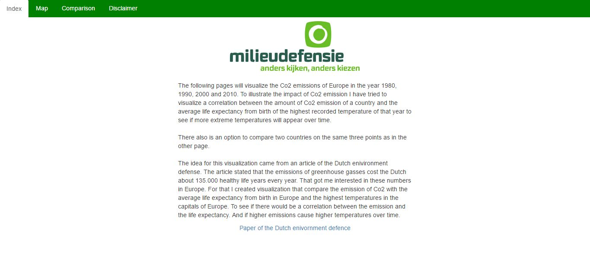
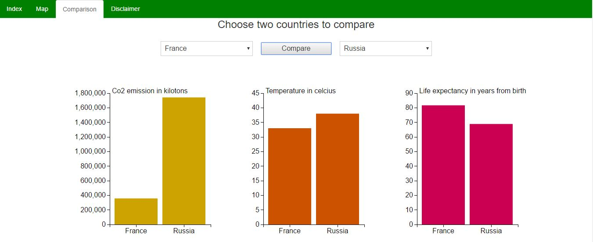

# Programmeer project
Thom Mekelenkamp - 11167998

# Index
- Doel
- Ontwerp
- Schets
- Data
- Externe bronnen
- Limitaties
- MVP

# Doel
Met mijn visualisatie wil ik de uitstoot van de Europese landen in kaart brengen
en op zoek gaan naar een correlatie tussen de uitstoot van de landen en de levensverwachting, en tussen
de uitstoot en de hoogst gemeten temperatuur.

Het doel is om mensen te informeren over de uitstoot in Europa en te vergelijken of dat
in de afgelopen 40 jaar invloed heeft gehad op de levensverwachting of de temperatuur.

# Ontwerp
Op de eerste pagina staat een stukje inleidende tekst over het onderwerp en wat ik met
de visualisaties wil laten zien en waar ik de inspiratie vandaan heb.

De tweede pagina bestaat uit een wereldkaart die in de uitstoot, levensverwachting
of de gemiddelde temperatuur van Europese landen. Er kan tussen de 3 variabelen
worden gekozen om snel inzichtelijk te maken waar bijvoorbeeld de meeste uitstoot is.
En om voor mensen duidelijk te maken welke landen er allemaal worden meegerekend.

Onder de wereldkaart zal een scatterplot komen waar van verschillende jaren de uitstoot
wordt vergeleken met de levensverwachting of de temperatuur. Met een selector kan er
op de y as worden gewisseld tussen temperatuur en levensverwachting. Daarnaast kan er met een
selector worden gewisseld tussen de verschillende jaren van de data.

Op de derde pagina zijn 2 selectors waarop de gebruiker kan selecteren welke landen
hij wilt vergelijken. Door dan op de compare knop te drukken verschijnen er 3 barcharts
met de uitstoot, levensverwachting en temperatuur data van de 2 gekozen landen.

Op de vierde pagina staat de disclaimer met de sources van de data die ik heb gebruikt
en nog een stukje over de temperatuur data die alleen van de hoofdsteden is en niet van
het hele land.

# Schets

# Data

De volgende bronnen heb ik gebruikt voor data:
http://data.worldbank.org/indicator/SP.DYN.LE00.IN/countries?display=default
http://data.worldbank.org/indicator/EN.ATM.CO2E.KT/countries/1W?display=default
https://weatherspark.com

# Externe bronnen

Voor de visualisaties heb ik een aantal libraries nodig:
- jquery
- bootstrap
- topojson
- D3
- Datamaps
- D3 tip
- D3 queue

# Limitaties
Een limiet voor dit project kan zijn dat ik voor sommige landen maar heel weinig dat
kan krijgen. Dit limiteerd mij in het aantal soorten grafieken en vergelijkingen
die de visualisatie kan maken.

# MVP
Mijn minimal viable product is een kaart waar op kleur geselecteerd de co2 uitstoot, de
levensverwachting en de temperatuur in staan.

Waarbij ik een scatterplot heb die in van tenminste 1 jaar de Co2 data tegenover de
temperatuur kan weergeven. En waarbij de Y as kan worden veranderd voor de levensverwachting.

En er moeten 2 landen met elkaar vergeleken kunnen worden. Bij deze vergelijking moeten
er 3 barcharts in beeld komen met de temperatuur, levensverwachting en co2 uitstoot.
