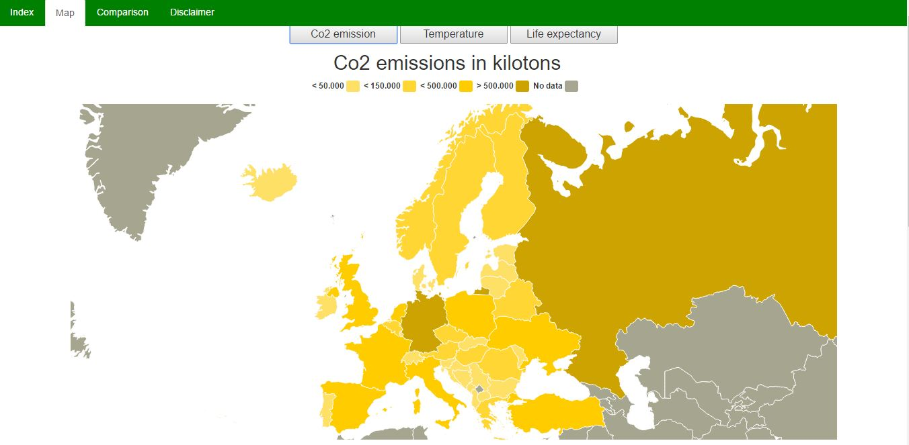
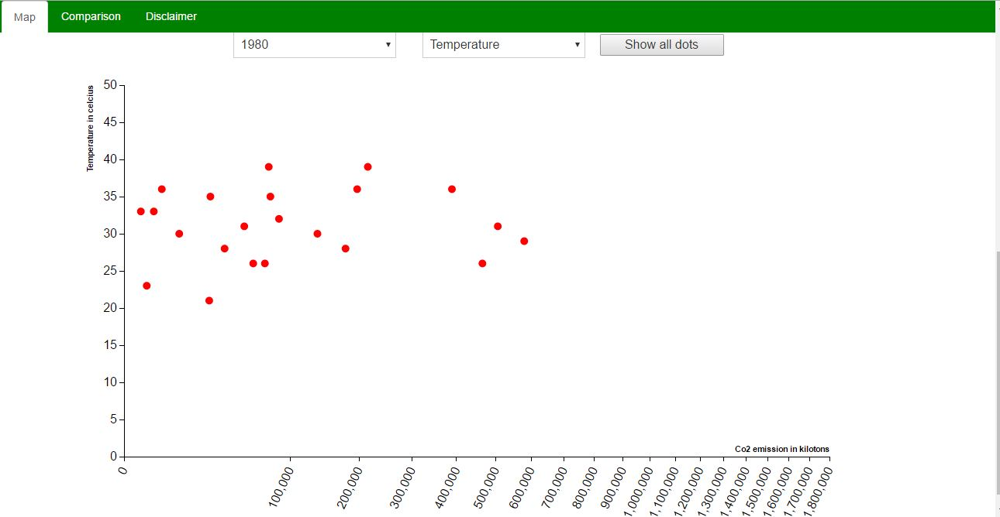

# Visualisatie

Mijn visualisatie gaat over de verhouding tussen Co2 emissie van de Europese landen,
de levensverwachting en de hoogste gemeten temperatuur in al deze landen om te
kijken of er een verband is.

Daarbij vergelijk ik op de eerste pagina de maximale temperatuur die in een land gemeten is in de jaren
1980, 1990, 2000, 2010 om te kijken of de hogere uitstoot ook hogere temperaturen tot
gevolg heeft. Hiervoor heb ik een kaart van Europa die is ingekleurd aan de hand
van de uitstoot, levensverwachting of de temperatuur. Daaronder staat een scatterplot
die de verhouding tussen de uitstoot en de levensverwachting of temperatuur weergeeft.
Deze plot kan nog worden geselecteerd op jaar.

Wanneer er op een land op de kaart wordt geklikt worden alle dots van de scatterplot
lichter en wordt de dot van het betreffende land gehighlight. Er is ook een knop
die alle dots weer hun oorspronkelijke formaat en kleur terug geeft.

Op het tweede deel van de pagina kunnen er twee landen direct met elkaar vergeleken
worden op de uitstoot, levensverwachting en de temperatuur. Dit door middel van barcharts.

# Technisch

Om voor mijzelf zo veel mogelijk overzicht te houden heb ik verschillende javascript bestanden en
css sheets gemaakt.

* src/
Hier staan alle javascript bestanden en de html pagina

* temperatureMap.js, emissionMap.js, lifeMap.js
In deze bestanden worden de kaarten van Europa gemaakt met verschillende datasets.
De main functie in deze bestanden zorgt er voor dat de juiste data wordt ingeladen,
de kaart wordt verdeeld met de juiste fillkeys en dat de kaart met legenda wordt
aangemaakt.

In deze files zit ook een findcountry functie die met een landnaam de id's van
datamaps kan ophalen zodat de landen kunnen worden ingekleurd.

* main.js
Er staan 3 functies in dit betstand. De eerste twee laden de data voor de
scatterplot in, formatten deze en passen het uiterlijk van descatterplot aan.
De derder functie zorgt ervoor de er landen in de landselectors op de compare pagina
komen te staan.

Er wordt opnieuw data van 3 json bestanden ingeladen. De benodigde data wordt doormiddel van een loop in lijsten
geplaatst zodat de data gebruikt kan worden bij het maken van de scatterplot.
Er wordt gekeken welke waarde de selector met jaren heeft om te bepalen van welk jaar
de data moet worden doorgegeven. Daarna wordt de drawScatter functie aangeroepen en de
juiste data wordt meegegeven.

De tweede functie in dit bestand is de reset scatter functie. Wanneer er op een land
is gedrukt op de kaart wordt de opacity van alle dots in de scatterplot verlaagd en
wordt die van het geselecteerde land groter gemaakt. Om dit te resetten staat er een
button boven de scatterplot die dat weer reset zodat alle dots hun originele formaat
en opacity krijgen.

De derde functie van dit bestand is de create selectors functie. Deze laad een lijst
met de Europese landen op alfabetische volgorde in en maakt daarmee de selectors die
op de compare pagina komen te staan. Dit om te voorkomen dat er in de HTML code
2 lijsten moesten komen te staan die veel te lang waren om te hardcoden.

* scatter.js
In dit bestand staat de drawScatter functie die de scatterplot op de pagina maakt.
Deze functie maakt gebruik van de dataset die vanuit de scatterData functie in main.js
wordt doorgegeven.

Aan het begin van de functie wordt er een container aangemaakt in de scatter div waar
de plot in moet komen te staan. Daarna wordt er gekeken op welke selectie de variable
selector van de plot staat: temperatuur of levensverwachting. Aan de hand van de waarde
die daar uit komt wordt er in een if - else bepaald wat de min en max van de y as moeten
worden samen met de text die langs de y-as moet komen te staan.

Dan worden er zoals bij elke d3 visualisatie marges en formaten bepaald, schalen voor
de x en y as en de x en y as zelf gedefinieerd. Dan wordt er nogmaals gecheckt welke
waarde de variable selector heeft om te bepalen welke data er moet worden meegegeven
aan de tooltip.

Dan worden het SVG element aangemaakt en de assen met dots op de pagina gezet.
Bij het maken van de dots zijn er nog wel checks om te kijken of er van beiden sets
op de x en y as ook data is. wanneer dat niet het geval is wordt de dot niet zichtbaar in de plot
om zo te voorkomen dat er veel dots tegen de x of y as aan plakken, en daarmee een verkeerd beeld
van de data geven. Als laatste staat er de mouseover die de tooltip aanroept.

* compare.js
In deze file staan 2 functies: compare en getData. In deze functies wordt er gekeken
welke landen er op de compare pagina zijn geselecteerd om te vergelijken en wordt de
data van deze landen opgehaald en in de juite formate geplaats. Dan wordt met die data
de barchart functie aangeroepen.

De compare functie wordt aangeroepen wanneer er door de gebruiker op de compare knop
wordt gedrukt. Dan wordt de waarde van de twee landselectors opgehaald. Er wordt dan
met een if - else gecheckt of de landen een spatie in hun naam hebben, zo ja dan krijgen
ze een ander id zodat de data uit de json kan worden gehaald. Er wordt dan in een loop
3 keer de gedData functie aangeroepen met verschillende variabelen. Welke op zijn beurt
de drawBar functie aanroept waardoor er 3 barcharts op de pagina verschijnen.

De getData functie krijgt van de compare functie door in welke file hij moet zoeken voor
de data en naar welke landen. Daarbij krijgt de functie nog een 3 andere variabelen mee
die moeten worden doorgegeven aan de drawBar functie. De getData functie laad de juiste
json in en zoekt dan naar de data van de 2 landen in die json. Deze data wordt vervolgens in een
list gezet en daarna in de juiste format in een tweede lijst gezet. Dan roept hij de
drawBar fucntie aan met de juiste data en de extra variabelen die eerder zijn meegegeven.

* barchart.js
In dit bestand staat 1 functie die de barcharts op de pagina maakt. De functie wordt
3 keer aangeroepen en daarmee worden er 3 barcharts gemaakt voor de verschillende data.

Als eerste worden er margins en formaten van de barcharts gedefinieerd. Daarna worden
ook de schalen voor de x en y as, de assen zelf en de tooltip gedefinieerd. Dan wordt
het SVG element aangemakt samen met de x en y domain. Vervolgens worden de assen en de
bars op toegevoegd samen met de titels. Dan nog staat er nog de mouseover die de tooltip
aanroept.

# Challenges

* Kaarten
Momenteel heb ik voor de 3 verschillende kaarten op de pagina ook 3 verschillende kaart functies.
De functies zijn bijna gelijk aan elkaar. Dit had ik graag omgebouwd tot één functie die
alle data ophaald en dan één kaart maakt en daarna met een aparte functie de landen inkleurd.

Echter had ik vooral met het kleuren problemen met de kleuren van de kaart. Aangezien de
data in getallen ver uiteen lopen. Hierdoor was het lastig om een algemene if - else te maken.
Ik had geprobeerd om de data die voorbij kwam X0.25, 0.50, 0.75 te doen. Om zo variabel de
data in groepen te kunnen splitsen. Echter maakten deze berekeningen geen grote verschillen in
de getallen. Hierdoor kreeg een groot deel van de kaart de zelfde fillkey en daarmee werd het
doel van de kaart teniet gedaan.

om dit op te lossen had ik dus 3 keer een vrijwel identieke functie gemaakt zodat de kaart zou werken.
Met als doel voor ogen dat ik wanneer ik alle onderdelen gemaakt had kon veranderen naar een aparte functie.
Er bleef alleen niet genoeg tijd over aan het eind van het project om dat nog te veranderen.
Daarom koos ik er voor om dit zo te laten.

* Data inladen
Het inladen van de data gaat in de visualisatie nu op meerdere plekken en ook telkens opnieuw.
Het plan om alles met de zelfde set jsons te doen kwam als snel ten einde toen ik voor mijn
barcharts eigenlijk beter kon werken met keyed jsons die in dit geval de landnamen als keys
gebruikte.

Hierdoor moest ik voor de barcharts opnieuwd data inladen. Ik had het geluk dat de dataset
niet enorm groot is wat het laden van de pagina niet direct belemerd, maar het was wel soepeler
geweest als ik alles maar 1 keer had hoeven laden.

Nadat ik meerdere keren data moest laden wilde ik eigenlijk in main.js in 1 keer alle jsons inladen
en dan dat die door alle code heen kunnen worden gebruikt. Echter had ik daarvoor ook de code van
de kaarten moeten veranderen aangezien die nu nog werken met het format van de oude jsons.

Als ik meer tijd had zou ik dus graag de data op 1 centraal punt inladen en zorgen dat alle visualisaties
met de zefde json werken om het zo sneller en voor de design kant beter te maken.

* Scatterplot
Dit project was de eerste keer dat ik een scatterplot ging maken en ondanks dat vrijwel
alle d3 visualisaties de zelfde opbouw hadden, had ik wel wat problemen met het aanmaken van de dots.

Aangezien het kan zijn dat ik van een jaar data mis van bijvoorbeeld de uitstoot of de temperatuur.
Kan de dot niet juist geplaatst worden op de assen. Hierdoor gaan de dots "plakken" op 1 van de assen.
Het voorkomen hiervan was lastig aangezien missende data in mijn jsons staat als "No data".
Hierdoor kreeg je in de console steeds de NaN(not a number) error.

Om allereerst te voorkomen dat deze dots in beeld kwamen besloot ik met een statment op te checken of
de dot die geplaatst zou worden een NaN op een van de assen had. Als er een NaN error voor kwam
gaf ik deze dots een style argument mee waardoor deze dots niet meer zichtbaar waren in de plot.

Hiermee leek het probleem opgelost maar nog steeds kwamen de errors in de console. Om dit op
te lossen heb ik nog een statment geplaatst die checkt voor de x en y waaren of ze NaN zijn.
Als dit het geval is wordt de waarde van "No data" naar 0 gezet. Hierdoor kan de dot wel plaatst worden.
Daarna worden deze dots nog steeds onzichtbaar gemaakt en ziet de plot er goed uit en genereerd deze
geen errors meer in de console.

Ik vind het persoonlijk de beste oplossing voor dit probleem. Andere mensen om me heen die ik
gevraagd had hadden ook geen oplossing voor dit probleem. 1 iemand had het zelfde probleem en
met ook een soortgelijke oplossing. Er zijn mogelijk betere manieren om dit op te lossen
alleen kon ik binnen de tijd die ik stelde voor het maken van de plot geen andere manier bedenken.
